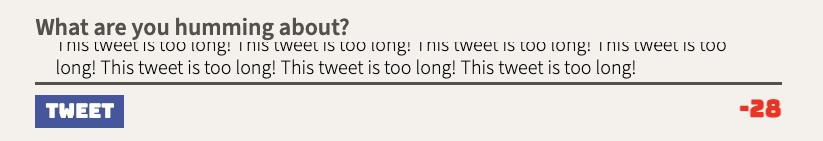

# Tweeter Project

Tweeter is a simple, AJAX-based single-page Twitter clone, made as a front-end development project. Some starter back-end code was provided and is contained within this repository.

## Getting Started

1. [Create](https://docs.github.com/en/repositories/creating-and-managing-repositories/creating-a-repository-from-a-template) a new repository using this repository as a template.
2. Clone your repository onto your local device.
3. Install dependencies using the `npm install` command.
3. Start the web server using the `npm run local` command. The app will be served at <http://localhost:8080/>.
4. Go to <http://localhost:8080/> in your browser.

## Final Product
**Mobile View:**

**Desktop View**

**Character Counter**

## Dependencies

- Express
- Node 5.10.x or above
- body-parser 1.15.2
- chance 1.0.2
- md5 2.1.0

## Using the App

To create a tweet, fill out the "what are you humming about?" form at the top of the page's body. Tweets must be less than 140 characters, and may not be empty. Clicking tweet will generate a Tweeter user, and your tweet will appear at the top of the page's feed

